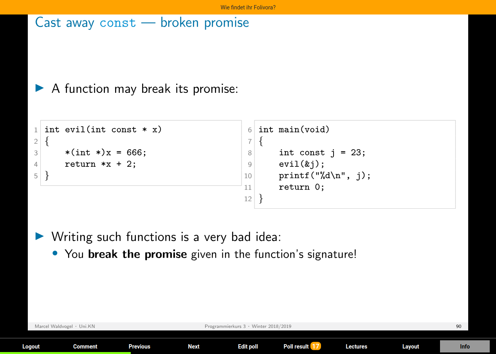
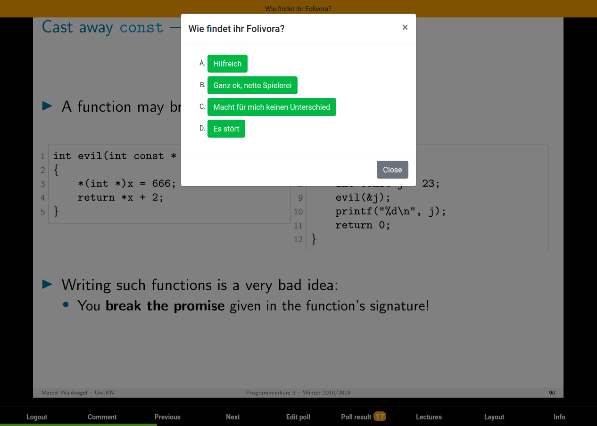
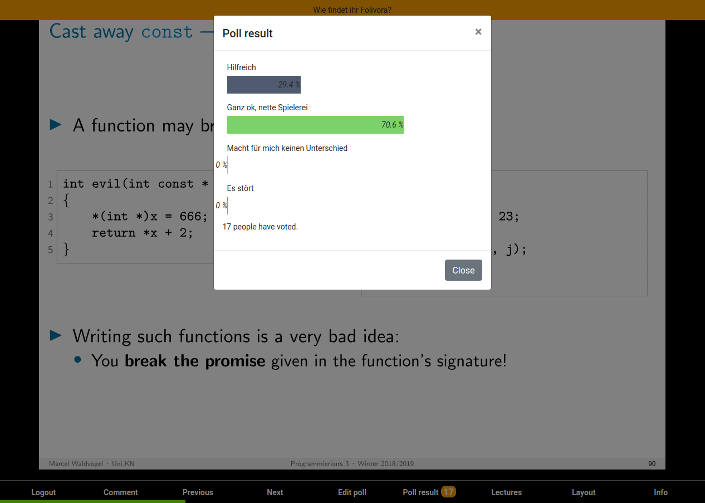
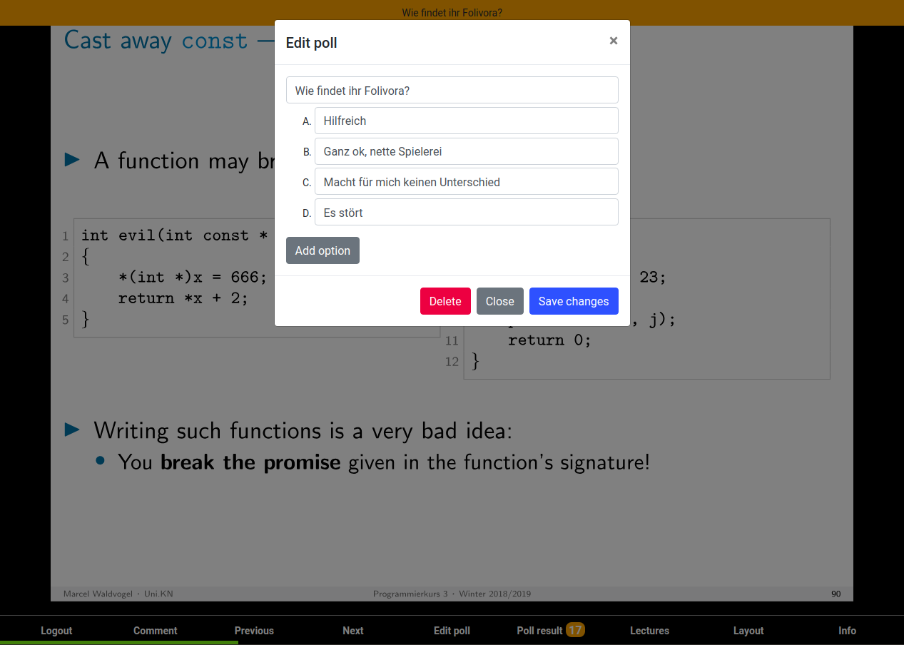
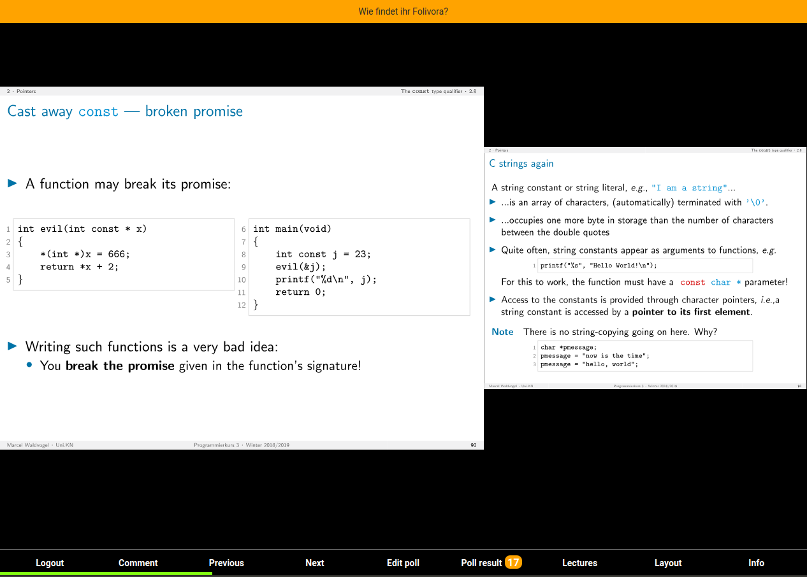

# Folivora
Folivora is an interactive slide presenter which aims to enhance lectures and collect live feedback from students.

The basic workflow is as follows: At the beginning of every lecture the docent is sharing a session link with the audience. The link opens a website with the current slide and the possibility to comment or participate on predefined polls. The aim is to increase the interaction with the students and to reduce the fear to look stupid.

Currently the project is a working prototype and it's being tested at the University of Konstanz in two lectures. This means it's not fully stable and some functions are not available via the web UI (e.g. slide upload) and we are only supporting slides in PDF format.

## :heart_eyes: Features
Folivora provides the following features:

- Sharing presenter monitor with the audience
- Polls with live voting results
- Anonymous comments
- Multiple layouts for the lecturer
- Persistent authentication
- Progress bar

## :hourglass_flowing_sand: Planed features
- Lecture sessions (After the lecturer closes a session the student login is no longer valid)
- Multi lecturer support (with groups)
- Lecture management (e.g. uploading, deleting slides)
- New UI (e.g. Vue or React)
- Audio/Video broadcast
- Different poll types
- Students should be able to go to previous slides
- Students should be able to add comments
- Students should be able to discuss with other students
- Internationalization
- Unit tests

## :camera: Screenshots
### Admin view

### Info view with the student code

### Voting view

### Voting results

### Polls can be easily updated

### The lecturer can preview the next slide

## :rocket: Quick start
To start your own server, clone this repository and execute the following commands inside your new directory:

- `yarn install`
- `yarn build`
- `mkdir database`
- `mkdir -p public/lectures/YOUR-LECTURE-NAME` (dashes will be replaced by spaces in the UI)
- `pdf2svg YOUR.pdf public/lectures/YOUR-LECTURE-NAME/%d.svg all`
- `yarn start`
- Open `localhost:3000` in your browser
- Try to login as lecturer. This will fail, but provide you with the correct authentication token in the server log.
- Add your username and token as key/value pair to the `lecturer` key in `config.json`. E.g. `{"lecturer": {"klaus": "TOKEN"}}`.
- Restart your server.

If you are a developer, you can also use `yarn dev-client` and `yarn dev-server` to automatically rebuild and restart the server if a file changes.

## :clap: Contribution
You are welcome to contribute to this project in various ways:

- Testing: It's super important to test an application, so please check new (beta) releases and [open an issue] if you find any misbehavior.
- Code: If you like to work on a new feature, please [open an empty pull request] and describe what you are planning to do. This way we reduce the possibility that two people are working on the same feature.
    - Fork this repository
    - Create a new branch for your feature
    - Open a pull request and describe what you like to change/implement
    - Start working on your feature
    - Commit your changes with a helpful commit message
    - Wait until the pull request is merged :tada:
- Promote: We are grateful if you help us to make Folivora more known.

[open an issue]: https://github.com/disy/folivora/issues/new
[open an empty pull request]: https://github.com/disy/folivora/pull/new/master